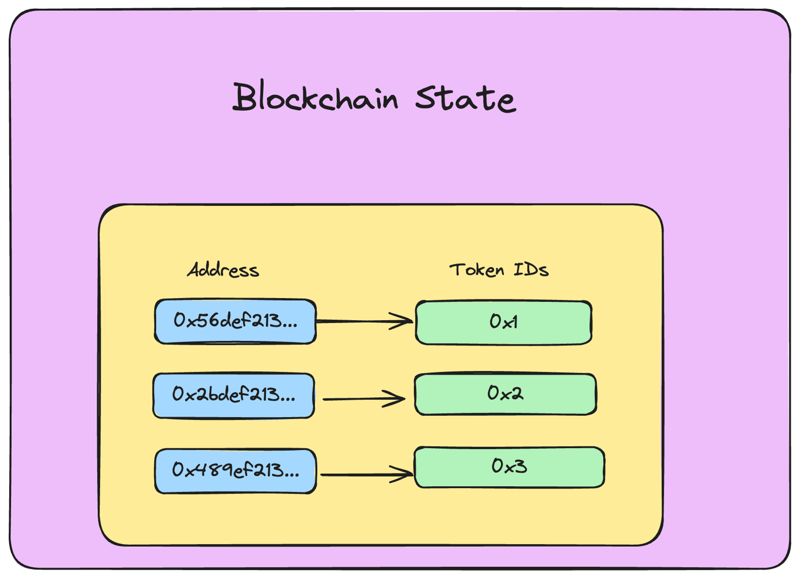

# Sharded NFTs =nil;

Let's explore sharded NFTs?

**Why NFTs?**

---

The first and obvious question is, why?

NFTs are a proven use case across all blockchains, and they have often reflected the scaling issues with the current blockchain networks like Solana and Ethereum.

Take [this](https://blockworks.co/news/solana-and-ethereum-suffer-weekend-disruptions-thanks-to-nft-mints) article, for example, talks about how Solana was halted for hours while Ethereum became too expensive to use during the mint of [Otherside](https://otherside.xyz/); **more than 180 million USD worth of ETH** was consumed during this mint back in 2022!

> Hence, simulating high-volume NFT mints, like the 95000 Virtual Land NFTs in the Otherside case, can be a great way to see the benefits of using a sharded architecture in blockchains.

## NFTs are just a bunch of records stored on chain

---

In their simplest form, NFTs are just a series of records stored on the Blockchain State! It is a mapping storing `address → nft_token_id`.

