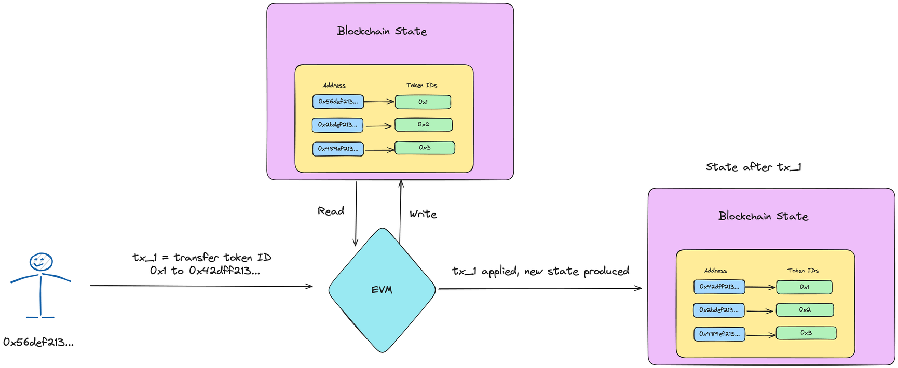

# Sharded NFTs =nil;

Let's explore sharded NFTs?

**Why NFTs?**

---

The first and obvious question is, why?

NFTs are a proven use case across all blockchains, and they have often reflected the scaling issues with the current blockchain networks like Solana and Ethereum.

Take [this](https://blockworks.co/news/solana-and-ethereum-suffer-weekend-disruptions-thanks-to-nft-mints) article, for example, talks about how Solana was halted for hours while Ethereum became too expensive to use during the mint of [Otherside](https://otherside.xyz/); **more than 180 million USD worth of ETH** was consumed during this mint back in 2022!

> Hence, simulating high-volume NFT mints, like the 95000 Virtual Land NFTs in the Otherside case, can be a great way to see the benefits of using a sharded architecture in blockchains.

## NFTs are just a bunch of records stored on chain

---

In their simplest form, NFTs are just a series of records stored on the Blockchain State! It is a mapping storing `address → nft_token_id`.

## EVM only does operation at a time ⚠️

---

As we speak, most of the EVM chains lack paralleization and can only process one transaction at a time, which means that if 2 people want to mint/sell an NFT collection, one would be done before another!

In the below case, if some wants to transfer there NFT, and if they are the only person who wants to do it { + if this is the only operation on the chain }! Then they will get immediate access to the EVM, and the EVM based on their transaction will update the mapping and produce the new blockchain state.

If, there were two EOAs who want to transfer, mint or any other operation on their relative NFT, then one of them will get access to the VM before the another.

Now, this scenario will play good enough till we have a few number of such requests! Ethereum can do 10-20 TPS, while some EVM L2s can do 40-50 { some can even claim 100+ TPS }.

But, this is still not enough for scenarios where there is high demand for blockspace for such Tokens!

> For example take, launch of an RWA where someone is tokenizing 100k shares of an RWA, so at the time of the launch there is demand for 100k Token Mints!

> If we take an average TPS per EVM chain to be around 50 TPS, that is still on average 2000 seconds of wait time! Which is 33 minutes on average per mint!

> Imagine the gas fees spikes as so many people want to access the same the VM at the same time, this will exclude so many people who want to particiapate in this RWA, who just simply cannot participate as they cannot outbid whales for gas! { this is truly a question of financial inclusion! }

